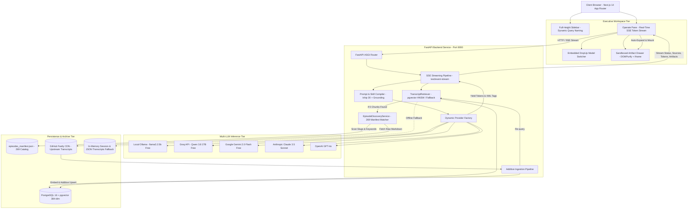

# 🎙️ The Lenny Growth Assistant
> **Enterprise-Grade AI Product Advisor & Content Engine over 269 Curated Podcasts (~3.5M Words)**

[](https://www.typescriptlang.org/)
[](https://nextjs.org/)
[](https://fastapi.tiangolo.com/)
[](https://github.com/pgvector/pgvector)
[](https://github.com/ChatPRD/lennys-podcast-transcripts)
[](https://ollama.com/)
[](LICENSE)

The **Lenny Growth Assistant** transforms 269 candid, operational interviews from *Lenny’s Podcast* into an interactive AI intelligence terminal for Growth PMs, VPs of Product, and Startup Founders. It features **Just-In-Time (JIT) Dynamic Episode Discovery & Additive Ingestion**, **100% Grounded RAG Search**, a dedicated **Ship 30 for 30 Content Engine** (`/ship <topic>`), an interactive **Claude-Style Sandboxed Artifact Workspace**, and a **Dynamic Multi-Model Layer** bridging free local inference (`llama3.2:3b`) with high-throughput cloud models.

---

## 🌟 Executive Highlights & Core Differentiators

| Capability | What It Solves | Architectural Innovation |
| :--- | :--- | :--- |
| **🔍 Just-In-Time Dynamic Discovery** | Accesses the entire 269-episode universe on demand without requiring massive upfront vector database overhead. | In-memory 269-episode manifest scan (`episodes_manifest.json`) paired with CDN-backed dynamic fetching (`raw.githubusercontent.com`) and non-destructive additive pgvector upserting. |
| **🛡️ Deterministic Grounding & Circuit-Breaker** | Eliminates AI speculation and hallucinations on tactical growth decisions. | Two-tier gating: Word-boundary discovery rejection + PostgreSQL `pgvector` HNSW cosine similarity gating ($< 0.65$ threshold) yielding instant standard refusals (*"I do not have sufficient information in Lenny's podcast archive to answer this."*). |
| **✍️ Ship 30 for 30 Content Engine (`/ship`)** | Solves the "Actionability Gap" by turning conversational answers into shareable assets. | Compiles raw podcast transcripts into ~1,250-word atomic essays featuring 4A framework pathways, line 1–3 curiosity hooks, and bold bullet anchors. |
| **🔒 Hardened Sandboxed Artifact Workspace** | Prevents XSS vulnerabilities when executing AI-generated interactive calculators. | Two-tier security sandbox: `DOMPurify` HTML sanitization + isolated `<iframe>` (`sandbox="allow-scripts"` strictly omitting `allow-same-origin`, resulting in a unique `null` origin). |
| **⚡ Multi-Model Decoupled Inference** | Solves API billing barriers while supporting deep frontier model reasoning. | Unified `BaseLLMProvider` supporting 100% free local Ollama (`llama3.2:3b`), free cloud Groq Qwen 27B & Gemini 2.0 Flash, plus Claude 3.5 Sonnet and GPT-4o. |
| **🎨 Warm Editorial Design System** | Eradicates bland "SaaS slop" chat interfaces in favor of executive typography. | Built on the Impeccable Design Methodology using the Warm Editorial palette (`#F5EBE0`, `#EDEDE9`, `#D6CCC2`, `#E3D5CA`, `#1C1917`) with full-height sidebar navigation. |

---

## 🏛️ System Architecture



---

## 📂 Folder Architecture & Project Structure

```text
The Lenny Growth Assistant/
├── frontend/                                # Next.js 14 App Router Frontend
│   ├── src/
│   │   ├── app/
│   │   │   ├── layout.tsx                   # Root layout with Warm Editorial fonts and metadata
│   │   │   ├── page.tsx                     # Full-height Sidebar + Main Header + Split Workspace
│   │   │   └── globals.css                  # Design tokens, scrollbar styling, no-whitebox bold text
│   │   ├── components/
│   │   │   ├── Chat/
│   │   │   │   ├── ChatPane.tsx             # Message thread, input bar, embedded DropUp LLM switcher
│   │   │   │   ├── MessageItem.tsx          # Markdown renderer with clean citation pill popovers
│   │   │   │   └── ModelSelector.tsx        # Minimal DropUp switcher, no logos, masked API key modal
│   │   │   └── Artifact/
│   │   │       ├── ArtifactViewer.tsx       # Claude-style preview/code viewer with sanitized text
│   │   │       └── SandboxedIframe.tsx      # Hardened iframe container for interactive HTML tools
│   │   ├── hooks/
│   │   │   └── useChatStream.ts             # SSE event consumer (status, sources, token, artifact)
│   │   └── lib/
│   │       └── api.ts                       # REST client & TypeScript data models
│   ├── tailwind.config.js                   # Warm Editorial palette tokens (obsidian, bone, sand, cream)
│   ├── package.json                         # Node dependencies & build scripts
│   └── tsconfig.json                        # TypeScript compiler options
├── backend/                                 # FastAPI Python Backend
│   ├── app/
│   │   ├── api/
│   │   │   ├── chat.py                      # SSE streaming endpoint with JIT Discovery trigger, /ship
│   │   │   ├── sessions.py                  # Session CRUD with in-memory fallback & validation
│   │   │   ├── providers.py                 # Multi-LLM status checks and masked key verification
│   │   │   └── health.py                    # Database and local Ollama health probes
│   │   ├── rag/
│   │   │   ├── discovery.py                 # 269-episode manifest matcher (word-boundary regex)
│   │   │   ├── retriever.py                 # pgvector search + local transcript similarity fallback
│   │   │   ├── embeddings.py                # Embedding pipeline (all-MiniLM-L6-v2 / 384-dim)
│   │   │   └── ingest.py                    # Additive & batch vector indexing engine
│   │   ├── providers/                       # Multi-LLM adapters (Ollama, Groq, Gemini, Claude, OpenAI)
│   │   │   ├── base.py                      # Abstract BaseLLMProvider interface
│   │   │   ├── ollama_provider.py           # Local Ollama streaming client
│   │   │   └── cloud_provider.py            # Unified Cloud API adapter (Groq/Gemini/Claude/OpenAI)
│   │   ├── skills/
│   │   │   ├── ship30_writer.py             # Ship 30 for 30 prompt builder (~1,250 words, hooks)
│   │   │   └── artifact_generator.py        # Defense-in-depth artifact cleaner and regex extractor
│   │   ├── models/                          # SQLAlchemy db models and Pydantic schemas
│   │   └── main.py                          # FastAPI factory, CORS middleware, router registrations
│   ├── data/
│   │   ├── episodes_manifest.json           # Master catalog of 269 episodes (guests, slugs, CDN URLs)
│   │   └── transcripts/                     # Locally cached downloaded episode markdown files
│   ├── scripts/
│   │   ├── sync_manifest.py                 # Script to fetch & build episodes_manifest.json from upstream
│   │   └── ingest.py                        # Standalone vector ingestion runner
│   ├── tests/                               # Backend automated test suite
│   │   ├── test_discovery.py                # Regex word-boundary matching and off-topic rejection tests
│   │   ├── test_jit_ingest.py               # Live integration test for single-episode additive upsert
│   │   ├── test_api.py                      # Session CRUD, chat validation, and health probes
│   │   ├── test_providers.py                # Multi-LLM initialization and fallback logic
│   │   └── test_retrieval.py                # Chunking, frontmatter parsing, Ship 30 prompt builder
│   ├── Dockerfile                           # Backend container specification
│   └── requirements.txt                     # Python dependencies
├── agent_transcripts/                       # Coding Agent Scaffolding & Iteration Transcripts
│   ├── 01_initial_scaffolding.md            # RAG pipeline, dual-model layer, and database setup
│   ├── 02_ui_refinement_and_security.md     # Layout invariants, DropUp switcher, and sandbox security
│   └── 03_dynamic_episode_discovery_jit.md  # 269-episode catalog, word-boundary discovery, JIT ingest
├── docs/                                    # System Documentation & Specifications
│   ├── PRD.md                               # Complete PRD with Discovery Brief & Success Metrics (v1.2.0)
│   ├── architecture.md                      # System Architecture Spec, Database Schema & Sequences (v1.2.0)
│   └── design.md                            # Impeccable Design System Spec & UI State Machine (v1.2.0)
├── resources/                               # Research Papers, Pricing Guides & Transcript Catalogs
│   ├── transcripts_source.md                # 269 curated transcript specifications & JIT workflows
│   ├── ship30_framework.md                  # Ship 30 for 30 essay heuristics and 4A pathways
│   ├── ollama_model_guide.md                # Hardware profiling for local LLM inference
│   ├── claude_agent_sdk_pricing.md          # Anthropic API pricing investigation
│   ├── openai_pricing_investigation.md      # OpenAI developer billing research
│   └── impeccable_ui_guide.md               # Impeccable 4-phase design loop reference
├── AGENTS.md                                # Workspace Agent Guidelines & Invariant Rules
├── docker-compose.yml                       # Multi-container orchestration (DB, Backend, Frontend)
└── README.md                                # Master project documentation
```

---

## 📋 Prerequisites & System Requirements

* **Supported OS:** Windows 10/11, macOS, or Linux.
* **Hardware Specs Tested:** AMD Ryzen 7 / Intel Core i7, 16 GB RAM (Zero GPU required).
* **Local Inference Setup:**
  1. Download [Ollama](https://ollama.com).
  2. Pull the optimized lightweight model:
     ```powershell
     ollama pull llama3.2:3b
     ```

---

## ⚡ Quick Start (Single-Command Docker)

```powershell
# 1. Clone repository
git clone https://github.com/your-username/The-Lenny-Growth-Assistant.git
cd "The Lenny Growth Assistant"

# 2. Configure environment
cp .env.example .env

# 3. Launch with Docker Compose
docker-compose up --build
```

* **Frontend Dashboard:** [http://localhost:3000](http://localhost:3000)
* **Interactive OpenAPI Docs:** [http://localhost:8000/docs](http://localhost:8000/docs)
* **Backend Health Probe:** [http://localhost:8000/api/health](http://localhost:8000/api/health)

### 💡 Featured Starter Queries & Skills

The workspace includes pre-configured prompts that showcase grounding, multi-model speed, and the Ship 30 for 30 Content Engine:

1. **Product Frameworks:**
   > *"What is Kunal Shah's Delta 4 framework for products?"*  
   *Synthesizes Kunal Shah's irreversible habit-forming product framework (efficiency score $\ge 4/5$, delta $> 4$) directly from the podcast transcript.*
2. **Operational Leadership:**
   > *"What is Shreyas Doshi's advice on managing time?"*  
   *Extracts Shreyas Doshi's LNO framework (Leverage, Neutral, Overhead) and calendar audit techniques.*
3. **Ship 30 for 30 Content Engine:**
   > *`/ship Write a 1,250-word Ship 30 essay on Elena Verna's B2B growth loops`*  
   *Compiles Elena Verna's PLG loops into a publication-ready atomic essay displayed in the split Artifact Workspace.*

---

## 💻 Local Standalone Setup (Without Docker)

### 1. Backend Service (FastAPI on Port 8000)
```powershell
cd backend
python -m venv venv
.\venv\Scripts\activate

pip install -r requirements.txt

# 1. Sync the 269-episode catalog manifest from upstream
python scripts/sync_manifest.py

# 2. Seed initial core episodes (or rely entirely on JIT dynamic on-demand indexing)
python -m app.rag.ingest

# 3. Launch FastAPI development server
python -m uvicorn app.main:app --host 0.0.0.0 --port 8000 --reload
```

### 2. Frontend Application (Next.js on Port 3000)
```powershell
cd frontend
npm install
npm run dev
```

---

## 🔄 Multi-Model Layer & Secure Key Manager

The system features an **Embedded DropUp Model Switcher** built right into the chat input box:
* **Local Ollama (Default - 100% Free):** `llama3.2:3b` streaming with sub-second TTFT.
* **Groq Cloud (Free Tier):** `qwen/qwen3.8-27b` for high-throughput cloud inference.
* **Google Gemini (Free Tier):** `gemini-2.0-flash` with quick-entry dialog.
* **Claude 3.5 Sonnet & GPT-4o (Paid Tier):** User-configured via masked key dialog (`gsk_••••••••••••3x9A`).

---

## 🧪 Automated Testing & Verification

### 1. Automated Backend Unit & Integration Test Suite
```powershell
cd backend
python -m unittest discover -s tests -p "test_*.py" -v
```
**Test Coverage:**
* `test_discovery.py`: Verifies word-boundary regex matching across guests, slugs, and domain keywords, plus strict rejection of out-of-domain queries (cooking, soccer, generic code).
* `test_jit_ingest.py`: Tests additive single-episode fetching from GitHub Fastly CDN, non-destructive upsert into pgvector, and sub-100ms vector retrieval.
* `test_parse_frontmatter`: Extracts YAML headers (`guest`, `title`, `date`) from transcripts.
* `test_recursive_character_chunking`: Enforces 500–800 token chunk boundaries with timestamp continuity.
* `test_artifact_extraction` & `test_artifact_sanitization`: Verifies XML tag regex parsing and tag-stripping.
* `test_clean_response_text`: Confirms zero raw XML tag leakage into conversational chat stream.
* `test_ship30_prompt_builder`: Verifies ~1,250-word constraint, line 1–3 hook prompts, and bold anchor structure.

### 2. Frontend TypeScript Typecheck
```powershell
cd frontend
npx tsc --noEmit
```
*Guarantees 0 compilation errors across all React components, custom hooks, and API client interfaces.*

### 3. Manual Feature Verification Checklist
1. **Full-Height Sidebar & Brand Identity:** Verify the sidebar spans `h-screen` top-to-bottom on the left and displays **`LENNY`** with tagline **`Growth-Assistant`**.
2. **Initial-Query Session Titling:** Send a query and verify the session title auto-updates to reflect the topic in real time.
3. **Just-In-Time Dynamic Episode Discovery:** Send a prompt regarding an unseeded episode (e.g., *"What did Casey Winters say about growth loops?"*). Observe the live SSE status pill progression (`Scanning Lenny's 269-episode catalog...` $\to$ `Found Casey Winters...` $\to$ `Indexing transcript into vector archive...`), followed by grounded answers with citations.
4. **Out-of-Domain Refusal Circuit-Breaker:** Query an off-topic subject (e.g., *"How do I bake lasagna?"*). Confirm immediate rejection: *"I do not have sufficient information in Lenny's podcast archive to answer this."* with 0 web search hallucinations.
5. **Ship 30 for 30 Content Engine:** Type `/ship <topic>` and verify the generated ~1,250-word atomic essay opens automatically in the right-hand Artifact Workspace.
6. **Interactive Sandbox Execution:** Request an interactive HTML artifact and verify it renders and functions inside the isolated sandbox (`sandbox="allow-scripts"` without `allow-same-origin`).
7. **DropUp Model Switcher:** Switch providers via the embedded DropUp menu. Open the API key config modal and confirm keys are masked without plain-text leakage.

---

## 🛠️ Operations, Troubleshooting & Engineer Handoff Guide

### 1. Observability & Health Probes
The backend exposes comprehensive endpoints and structured stdout logging formatted as:  
`%(asctime)s [%(levelname)s] %(name)s: %(message)s`

* **Global Service Health Probe:** `GET /api/health`
  * Checks database connection, vector table chunk counts, and local Ollama daemon connectivity.
* **Provider Live Status & Key Diagnostics:** `GET /api/providers/status`
  * Returns availability of each provider (`ollama`, `groq`, `gemini`, `claude`, `openai`) with masked API keys (`gsk_••••••••••••3x9A`).
* **Retriever & Grounding Logs:**
  * Displays similarity scores and matched episodes in real time (e.g. `Retrieved 2 verified moments (best score: 0.885) for query...`).
* **JIT Discovery Logs:**
  * Logs matching scores, CDN fetch durations, and chunk insertion counts (e.g., `[JIT] Match found: 'Casey Winters' (score: 1.0) -> Downloading & indexing...`).

### 2. Resilience & Failure Handling
| Failure Scenario | Automatic Mitigation & System Behavior |
| :--- | :--- |
| **Unindexed Episode Queried** | JIT Discovery scans `episodes_manifest.json`, downloads transcript from Fastly CDN in $<1.5\text{s}$, additively indexes chunks in $<3.5\text{s}$, and satisfies retrieval without server restart. |
| **Out-of-Domain / Non-Podcast Query** | Word-boundary regex filters discard unrelated topics; circuit breaker falls back to: *"I do not have sufficient information in Lenny's podcast archive to answer this."* |
| **Upstream CDN Timeout or Network Drop** | JIT fetcher times out after 10.0s, logs error, and returns standard grounded refusal without crashing the ASGI worker thread. |
| **Missing Cloud API Key** | The provider switcher gracefully falls back to local Ollama (`llama3.2:3b`) with an explicit log warning rather than dropping the turn. |
| **Ollama Daemon Offline** | Backend returns a clear user notification: `"Error: Unable to connect to local Ollama daemon at http://localhost:11434. Ensure Ollama is running ('ollama serve')."` |
| **Model Not Pulled in Ollama** | Returns a direct actionable instruction: `"Error: Model 'llama3.2:3b' is not pulled. Please run 'ollama pull llama3.2:3b'."` |
| **Model Generation Timeout** | Requests timeout set to 180s with periodic SSE `: keepalive\n\n` comments preventing client disconnection during long essay synthesis. |
| **Ungrounded Out-of-Domain Query** | Circuit-breaker triggers when cosine similarity is below threshold ($< 0.65$), strictly returning: *"I do not have sufficient information in Lenny's podcast archive to answer this."* |
| **PostgreSQL / pgvector Offline** | Dual resilient fallback: sessions persist to in-memory store backed by disk (`data/sessions_store.json`), and retrieval seamlessly falls back to local JSON transcript cosine similarity (`resources/transcripts/`). |
| **Artifact Malformation / Tag Leakage** | Multi-stage regex cleaning (`clean_artifact_content`, `clean_response_text`) guarantees zero raw XML tags leak into chat bubbles. |

### 3. How to Extend the System
* **Updating the Upstream 269-Episode Catalog:**
  1. Run `python scripts/sync_manifest.py` to parse upstream changes or new episodes published to `ChatPRD/lennys-podcast-transcripts`.
  2. The newly synced episodes are instantly discoverable via JIT dynamic fetching.
* **Adding New LLM Provider:**
  1. Create a new subclass inheriting from `BaseLLMProvider` in `backend/app/providers/`.
  2. Implement the async generator `generate_response(messages, system_prompt)`.
  3. Register the provider in `backend/app/providers/__init__.py` and add its option to `frontend/src/components/Chat/ModelSelector.tsx`.
* **Adding New Slash Command Skills:**
  1. Define a prompt template in `backend/app/skills/`.
  2. Register the slash command autocomplete trigger in `frontend/src/components/Chat/ChatPane.tsx`.

---

## 📚 Deliverables Catalog

* **Product Requirements Document:** [`docs/PRD.md`](docs/PRD.md)
* **System Architecture Specification:** [`docs/architecture.md`](docs/architecture.md)
* **Impeccable Design Specification:** [`docs/design.md`](docs/design.md)
* **Coding Agent Transcripts:** [`agent_transcripts/`](agent_transcripts/)
* **Foundational Resources Catalog:** [`resources/README.md`](resources/README.md)
* **Agent Invariant Rules:** [`AGENTS.md`](AGENTS.md)

