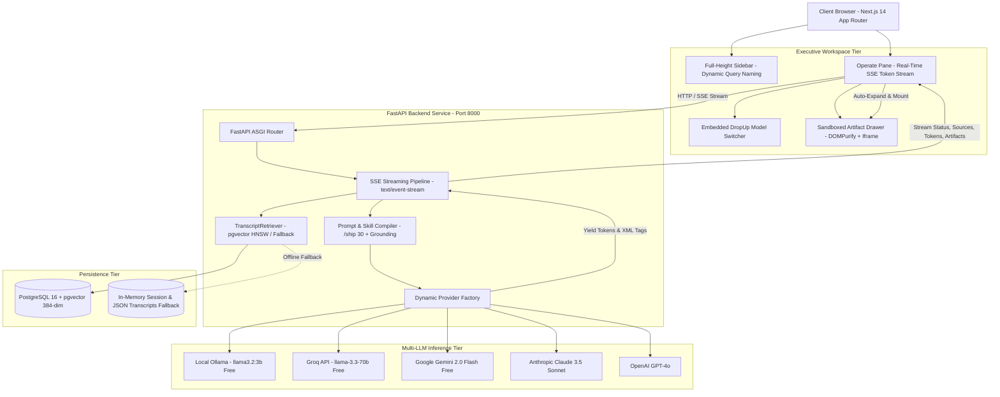

# 🎙️ The Lenny Growth Assistant
> **Enterprise-Grade AI Product Advisor & Content Engine over 200+ Curated Podcasts (~2.5M Words)**

[](https://www.typescriptlang.org/)
[](https://nextjs.org/)
[](https://fastapi.tiangolo.com/)
[](https://github.com/pgvector/pgvector)
[](https://ollama.com/)
[](LICENSE)

The **Lenny Growth Assistant** transforms 200+ candid, operational interviews from *Lenny’s Podcast* into an interactive AI intelligence terminal for Growth PMs, VPs of Product, and Startup Founders. It features **100% Grounded RAG Search**, a dedicated **Ship 30 for 30 Content Engine** (`/ship <topic>`), an interactive **Claude-Style Sandboxed Artifact Workspace**, and a **Dynamic Multi-Model Layer** bridging free local inference (`llama3.2:3b`) with high-throughput cloud models.

---

## 🌟 Executive Highlights & Core Differentiators

| Capability | What It Solves | Architectural Innovation |
| :--- | :--- | :--- |
| **🛡️ Deterministic Grounding & Circuit-Breaker** | Eliminates AI speculation and hallucinations on tactical growth decisions. | PostgreSQL `pgvector` HNSW cosine similarity gating ($< 0.65$ threshold) yielding instant standard refusals with zero ungrounded drift. |
| **✍️ Ship 30 for 30 Content Engine (`/ship`)** | Solves the "Actionability Gap" by turning conversational answers into shareable assets. | Compiles raw podcast transcripts into ~1,250-word atomic essays featuring 4A framework pathways, line 1–3 curiosity hooks, and bold bullet anchors. |
| **🔒 Hardened Sandboxed Artifact Workspace** | Prevents XSS vulnerabilities when executing AI-generated interactive calculators. | Two-tier security sandbox: `DOMPurify` HTML sanitization + isolated `<iframe>` (`sandbox="allow-scripts"` strictly omitting `allow-same-origin`, resulting in a unique `null` origin). |
| **⚡ Multi-Model Decoupled Inference** | Solves API billing barriers while supporting deep frontier model reasoning. | Unified `BaseLLMProvider` supporting 100% free local Ollama (`llama3.2:3b`), free cloud Groq 70B & Gemini 2.0 Flash, plus Claude 3.5 Sonnet and GPT-4o. |
| **🎨 Warm Editorial Design System** | Eradicates bland "SaaS slop" chat interfaces in favor of executive typography. | Built on the Impeccable Design Methodology using the Warm Editorial palette (`#F5EBE0`, `#EDEDE9`, `#D6CCC2`, `#E3D5CA`, `#1C1917`) with full-height sidebar navigation. |

---

## 🏛️ System Architecture



---

## 📂 Folder Architecture & Project Structure

```text
The Lenny Growth Assistant/
├── frontend/                                # Next.js 14 App Router Frontend
│   ├── src/
│   │   ├── app/
│   │   │   ├── layout.tsx                   # Root layout with Warm Editorial fonts and metadata
│   │   │   ├── page.tsx                     # Full-height Sidebar + Main Header + Split Workspace
│   │   │   └── globals.css                  # Design tokens, scrollbar styling, no-whitebox bold text
│   │   ├── components/
│   │   │   ├── Chat/
│   │   │   │   ├── ChatPane.tsx             # Message thread, input bar, embedded DropUp LLM switcher
│   │   │   │   ├── MessageItem.tsx          # Markdown renderer with clean citation pill popovers
│   │   │   │   └── ModelSelector.tsx        # Minimal DropUp switcher, no logos, masked API key modal
│   │   │   └── Artifact/
│   │   │       ├── ArtifactViewer.tsx       # Claude-style preview/code viewer with sanitized text
│   │   │       └── SandboxedIframe.tsx      # Hardened iframe container for interactive HTML tools
│   │   ├── hooks/
│   │   │   └── useChatStream.ts             # SSE event consumer (status, sources, token, artifact)
│   │   └── lib/
│   │       └── api.ts                       # REST client & TypeScript data models
│   ├── tailwind.config.js                   # Warm Editorial palette tokens (obsidian, bone, sand, cream)
│   ├── package.json                         # Node dependencies & build scripts
│   └── tsconfig.json                        # TypeScript compiler options
├── backend/                                 # FastAPI Python Backend
│   ├── app/
│   │   ├── api/
│   │   │   ├── chat.py                      # SSE streaming endpoint, initial-query session naming, /ship
│   │   │   ├── sessions.py                  # Session CRUD with in-memory fallback & validation
│   │   │   ├── providers.py                 # Multi-LLM status checks and masked key verification
│   │   │   └── health.py                    # Database and local Ollama health probes
│   │   ├── rag/
│   │   │   ├── retriever.py                 # pgvector search + local transcript similarity fallback
│   │   │   ├── embeddings.py                # Embedding pipeline (all-MiniLM-L6-v2 / 384-dim)
│   │   │   └── ingest.py                    # Transcript chunking and vector indexing script
│   │   ├── providers/                       # Multi-LLM adapters (Ollama, Groq, Gemini, Claude, OpenAI)
│   │   │   ├── base.py                      # Abstract BaseLLMProvider interface
│   │   │   ├── ollama_provider.py           # Local Ollama streaming client
│   │   │   └── cloud_provider.py            # Unified Cloud API adapter (Groq/Gemini/Claude/OpenAI)
│   │   ├── skills/
│   │   │   ├── ship30_writer.py             # Ship 30 for 30 prompt builder (~1,250 words, hooks)
│   │   │   └── artifact_generator.py        # Defense-in-depth artifact cleaner and regex extractor
│   │   ├── models/                          # SQLAlchemy db models and Pydantic schemas
│   │   └── main.py                          # FastAPI factory, CORS middleware, router registrations
│   ├── tests/                               # Backend automated test suite
│   │   ├── test_api.py                      # Session CRUD, chat validation, and health probes
│   │   ├── test_providers.py                # Multi-LLM initialization and fallback logic
│   │   └── test_retrieval.py                # Chunking, frontmatter parsing, Ship 30 prompt builder
│   ├── Dockerfile                           # Backend container specification
│   └── requirements.txt                     # Python dependencies
├── agent_transcripts/                       # Coding Agent Scaffolding & Iteration Transcripts
│   ├── 01_initial_scaffolding.md            # RAG pipeline, dual-model layer, and database setup
│   └── 02_ui_refinement_and_security.md     # Layout invariants, DropUp switcher, and sandbox security
├── docs/                                    # System Documentation & Specifications
│   ├── PRD.md                               # Complete PRD with Discovery Brief & Success Metrics
│   ├── architecture.md                      # System Architecture Spec, Database Schema & Sequences
│   └── design.md                            # Impeccable Design System Spec & UI State Machine
├── resources/                               # Research Papers, Pricing Guides & Transcript Catalogs
│   ├── transcripts_source.md                # 269 curated transcript specifications
│   ├── ship30_framework.md                  # Ship 30 for 30 essay heuristics and 4A pathways
│   ├── ollama_model_guide.md                # Hardware profiling for local LLM inference
│   ├── claude_agent_sdk_pricing.md          # Anthropic API pricing investigation
│   ├── openai_pricing_investigation.md      # OpenAI developer billing research
│   └── impeccable_ui_guide.md               # Impeccable 4-phase design loop reference
├── AGENTS.md                                # Workspace Agent Guidelines & Invariant Rules
├── docker-compose.yml                       # Multi-container orchestration (DB, Backend, Frontend)
└── README.md                                # Master project documentation
```

---

## 📋 Prerequisites & Evaluation Hardware

* **Evaluation OS:** Windows 10/11, macOS, or Linux.
* **Hardware Specs Tested:** AMD Ryzen 7 / Intel Core i7, 16 GB RAM (Zero GPU required).
* **Local Inference (100% Free Demo):**
  1. Download [Ollama](https://ollama.com).
  2. Pull the optimized lightweight model:
     ```powershell
     ollama pull llama3.2:3b
     ```

---

## ⚡ Quick Start (Single-Command Docker)

```powershell
# 1. Clone repository
git clone https://github.com/your-username/The-Lenny-Growth-Assistant.git
cd "The Lenny Growth Assistant"

# 2. Configure environment
cp .env.example .env

# 3. Launch with Docker Compose
docker-compose up --build
```

* **Frontend Dashboard:** [http://localhost:3000](http://localhost:3000)
* **Interactive OpenAPI Docs:** [http://localhost:8000/docs](http://localhost:8000/docs)
* **Backend Health Probe:** [http://localhost:8000/api/health](http://localhost:8000/api/health)

---

## 💻 Local Standalone Setup (Without Docker)

### 1. Backend Service (FastAPI on Port 8000)
```powershell
cd backend
python -m venv venv
.\venv\Scripts\activate

pip install -r requirements.txt

# Run transcript vector ingestion
python -m app.rag.ingest

# Launch FastAPI development server
python -m uvicorn app.main:app --host 0.0.0.0 --port 8000 --reload
```

### 2. Frontend Application (Next.js on Port 3000)
```powershell
cd frontend
npm install
npm run dev
```

---

## 🔄 Multi-Model Layer & Secure Key Manager

The system features an **Embedded DropUp Model Switcher** built right into the chat input box:
* **Local Ollama (Default - 100% Free):** `llama3.2:3b` streaming with sub-second TTFT.
* **Groq Cloud (Free Tier):** `llama-3.3-70b-versatile` pre-configured for high-throughput evaluation.
* **Google Gemini (Free Tier):** `gemini-2.0-flash` with quick-entry dialog.
* **Claude 3.5 Sonnet & GPT-4o (Paid Tier):** User-configured via masked key dialog (`gsk_••••••••••••3x9A`).

---

## 🧪 Automated Testing & Verification Gauntlet

### 1. Automated Backend Unit Test Suite
```powershell
cd backend
python -m unittest discover -s tests -p "test_*.py" -v
```
**Test Coverage:**
* `test_parse_frontmatter`: Extracts YAML headers (`guest`, `title`, `date`) from transcripts.
* `test_recursive_character_chunking`: Enforces 500–800 token chunk boundaries with timestamp continuity.
* `test_artifact_extraction` & `test_artifact_sanitization`: Verifies XML tag regex parsing and tag-stripping.
* `test_clean_response_text`: Confirms zero raw XML tag leakage into conversational chat stream.
* `test_ship30_prompt_builder`: Verifies ~1,250-word constraint, line 1–3 hook prompts, and bold anchor structure.

### 2. Frontend TypeScript Typecheck
```powershell
cd frontend
npx tsc --noEmit
```
*Guarantees 0 compilation errors across all React components, custom hooks, and API client interfaces.*

### 3. Evaluator Manual Verification Script
1. **Full-Height Sidebar & Brand Identity:** Confirm the sidebar spans `h-screen` top-to-bottom on the left and displays **`LENNY`** with tagline **`Growth-Assistant`**.
2. **Initial-Query Session Titling:** Ask *"What did Brian Chesky say about founder mode?"*. Observe the session title update in real time to match the topic.
3. **Ship 30 for 30 Content Engine:** Type `/` to trigger the slash command popover, select `/ship Elena Verna PLG loops`, and verify the generated ~1,250-word atomic essay opens in the right-hand Artifact Workspace.
4. **Interactive Sandbox Execution:** Ask *"Build an interactive HTML CAC/LTV payback calculator"*. Verify the calculator renders and functions inside the isolated sandbox (`sandbox="allow-scripts"` without `allow-same-origin`).
5. **DropUp Model Switcher:** Switch between *Local Ollama* and *Groq Llama 3.3 70B*. Open the API key config modal and confirm masked display without plain-text leakage.

---

## 🎥 Video Demo Walkthrough Guide (2–3 Minutes)

* **0:00 – 0:30 (Problem & Vision):** Introduce yourself and explain the problem: Growth PMs need battle-tested tactics from *Lenny's Podcast* without spending 200+ hours listening to audio.
* **0:30 – 1:15 (Grounded QA with Local Ollama):** Select `Local Ollama (llama3.2:3b)`. Ask: *"What did Brian Chesky say about founder mode?"*. Highlight sub-second TTFT streaming and click source citation pills.
* **1:15 – 1:45 (Ship 30 for 30 Content Engine):** Run `/ship Elena Verna PLG loops`. Demonstrate the 1,250-word atomic essay with hooks, short paragraphs, and bold anchors.
* **1:45 – 2:15 (Claude-Style Sandboxed Artifact Viewer):** Ask for an interactive HTML K-Factor calculator. Demonstrate live calculations inside the isolated sandbox.
* **2:15 – 2:30 (Model Switcher & Conclusion):** Demonstrate switching between Local Ollama and Free Cloud Groq in the DropUp menu. Conclude with single-command `docker-compose up` deployment readiness.

---

## 📚 Deliverables Catalog

* **Product Requirements Document:** [`docs/PRD.md`](docs/PRD.md)
* **System Architecture Specification:** [`docs/architecture.md`](docs/architecture.md)
* **Impeccable Design Specification:** [`docs/design.md`](docs/design.md)
* **Coding Agent Transcripts:** [`agent_transcripts/`](agent_transcripts/)
* **Foundational Resources Catalog:** [`resources/README.md`](resources/README.md)
* **Agent Invariant Rules:** [`AGENTS.md`](AGENTS.md)
