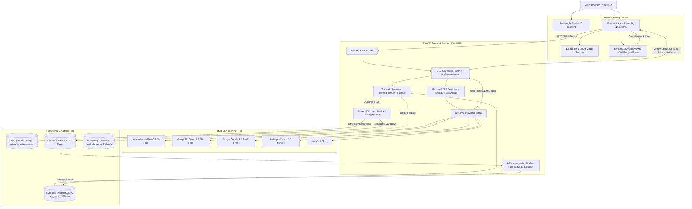
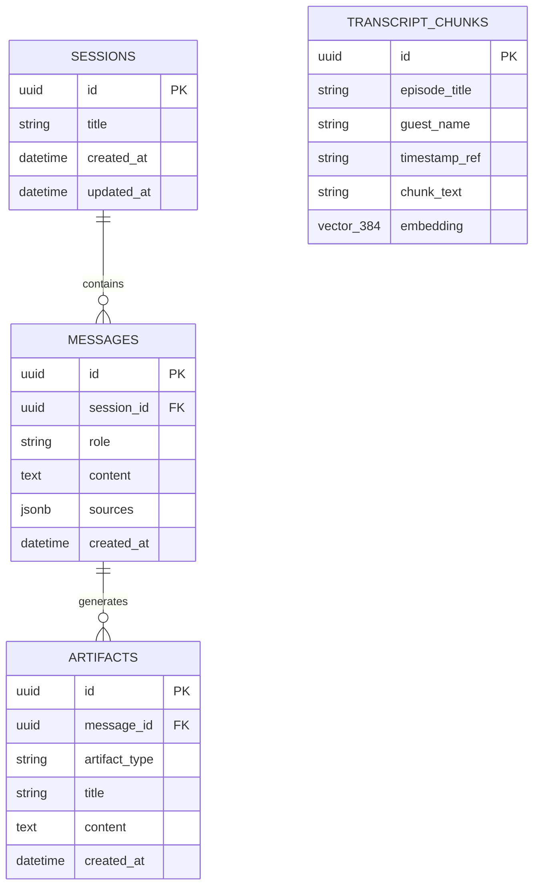
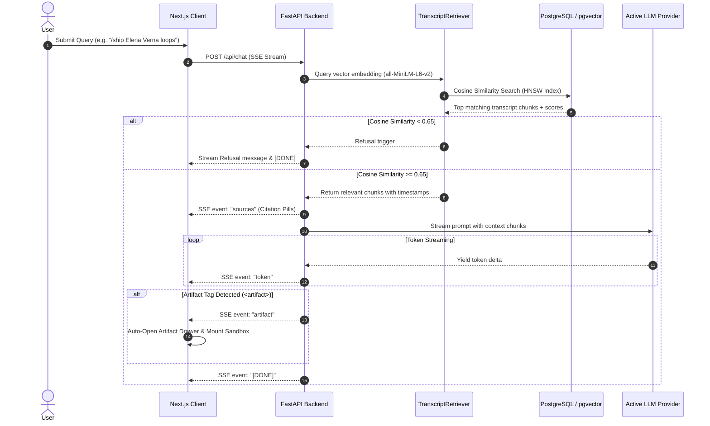
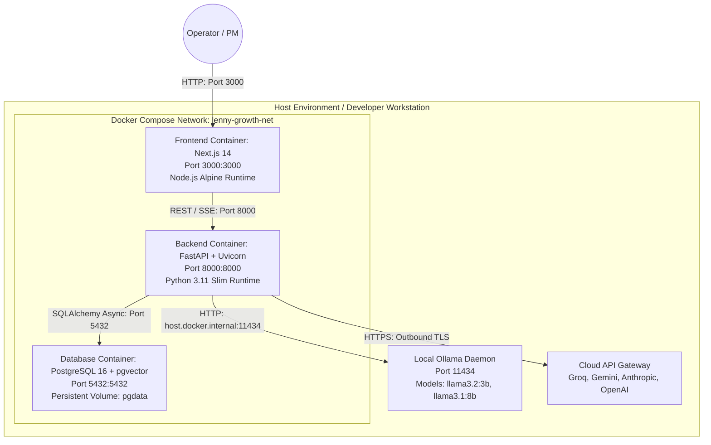

# ARCHITECTURE SPECIFICATION: THE LENNY GROWTH ASSISTANT

**Document Version:** 1.1.0  
**Status:** Approved for Implementation  
**System Target:** Enterprise RAG Platform with Multi-Model Routing & Sandboxed Artifact Execution  
**File Location:** `docs/architecture.md`  

---

## 1. Architectural Overview & System Topology

The Lenny Growth Assistant is a containerized, full-stack retrieval-augmented generation (RAG) web application architected to surface operational product and growth frameworks from *Lenny’s Podcast* transcripts (~2.5M words).

---

## 2. Component Boundaries & Responsibilities

### 2.1 Frontend Workspace (`frontend/`)
- **Framework:** Next.js 14 (App Router), React 18, TypeScript 5, Tailwind CSS 3.4.
- **Key Modules:**
  - `src/app/page.tsx`: Full-height layout coordinator (`h-screen w-screen`), managing sidebar toggling, top header transitions, and dual workspace splits.
  - `src/components/Chat/ChatPane.tsx`: Real-time streaming conversation container, dynamic initial-query titling, scenario-aware status pills, and `/ship` slash command trigger.
  - `src/components/Chat/ModelSelector.tsx`: DropUp model switcher with masked API key configuration modal (`gsk_••••••••••••3x9A`).
  - `src/components/Artifact/ArtifactViewer.tsx` & `SandboxedIframe.tsx`: Hardened iframe sandbox (`sandbox="allow-scripts"` without `allow-same-origin`) sanitized via `DOMPurify`.

### 2.2 Backend Application Tier (`backend/app/`)
- **Framework:** FastAPI (Python 3.10+), Uvicorn ASGI server, Pydantic v2.
- **Key Modules:**
  - `app/api/chat.py`: SSE streaming endpoint (`/api/chat`), refusal circuit-breaker gating ($<0.65$ cosine similarity), JIT fallback trigger, and dynamic session titling.
  - `app/api/sessions.py`: Session CRUD with PostgreSQL and resilient in-memory fallbacks (`IN_MEMORY_SESSIONS`).
  - `app/api/providers.py`: Live provider status probes and masked API key validators.
  - `app/rag/discovery.py`: In-memory 269-episode catalog matching engine (`find_matching_episode`) and GitHub CDN transcript downloader.
  - `app/rag/ingest.py`: Additive non-destructive episode ingestion (`ingest_single_episode`) and bulk chunk indexing.
  - `app/rag/retriever.py` & `embeddings.py`: SentenceTransformers (`all-MiniLM-L6-v2`, 384-dim) vector retrieval and local cosine similarity fallback.
  - `app/skills/ship30_writer.py` & `artifact_generator.py`: Prompt builder (~1,250-word essay) and multi-stage XML artifact cleaners.

### 2.3 API Endpoint Catalog & Request Contracts

| Method | Endpoint | Description | Request Payload / Params | Response Format |
| :--- | :--- | :--- | :--- | :--- |
| `POST` | `/api/chat` | Server-Sent Events (SSE) streaming chat endpoint. Orchestrates RAG, JIT fallback, and multi-model generation. | `ChatRequest` (session_id, message, mode, provider) + headers (`X-LLM-Key`) | `text/event-stream` (`status`, `sources`, `token`, `artifact`, `[DONE]`) |
| `GET` | `/api/sessions` | Retrieves all active conversation threads with dynamic titles. | None | `List[SessionResponse]` (JSON) |
| `POST` | `/api/sessions` | Creates a new conversation thread. | `SessionCreate` (title) | `SessionResponse` (JSON) |
| `GET` | `/api/sessions/{id}` | Retrieves full message history and artifacts for a specific session. | Path: `session_id` (UUID) | `SessionDetailResponse` (JSON) |
| `GET` | `/api/providers/status` | Probes configuration status of all 5 LLM providers. | Query / Headers | `Dict[str, ProviderStatus]` (JSON) |
| `POST` | `/api/providers/verify` | Live-tests and persists runtime API credentials. | `ProviderVerifyRequest` (provider, api_key) | `ProviderVerifyResponse` (JSON) |
| `GET` | `/api/health` | Comprehensive system health probe reporting DB and local Ollama state. | None | `HealthResponse` (JSON) |

---

## 3. Database Schema & Data Contracts

---

## 4. Ingestion & Retrieval Flow

---

## 5. Security & Isolation Architecture

1. **Two-Tier Iframe Sandbox:** All HTML/JS tools execute in `SandboxedIframe.tsx` using `sandbox="allow-scripts"` and strictly **omitting** `allow-same-origin`. This forces the iframe into a unique origin (`null`), blocking access to parent `document.cookie`, `localStorage`, and DOM trees.
2. **DOMPurify Sanitization:** HTML strings are cleansed of malicious script injections before mounting.
3. **API Key Safety:** Credentials in the frontend UI are masked (`gsk_••••••••••••3x9A`), sent via volatile session headers (`X-LLM-Key`), and never logged or persisted in plain text.

---

## 6. Multi-Container Deployment Topology

### 6.1 Container Specifications & Resilience Fallbacks
- **Frontend Service (`lenny-frontend`):** Built with multi-stage Next.js standalone output. Proxies API requests to the FastAPI backend.
- **Backend Service (`lenny-backend`):** FastAPI application managed by Uvicorn. Loads SentenceTransformers locally for vector embeddings. Automatically activates in-memory session persistence and local transcript cosine similarity if PostgreSQL is offline during standalone development.
- **Database Service (`lenny-postgres`):** Official `pgvector/pgvector:pg16` image initializing the `pgvector` extension, HNSW indexes, and persistent volume storage (`pgdata`).
- **Ollama Integration:** Accessible from within Docker via `http://host.docker.internal:11434` with zero API key requirement, guaranteeing complete private offline evaluation.
